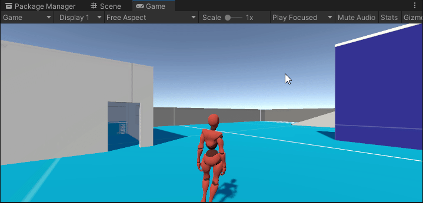
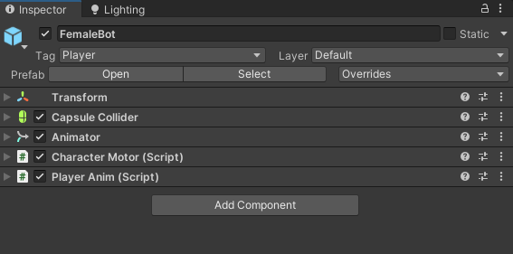
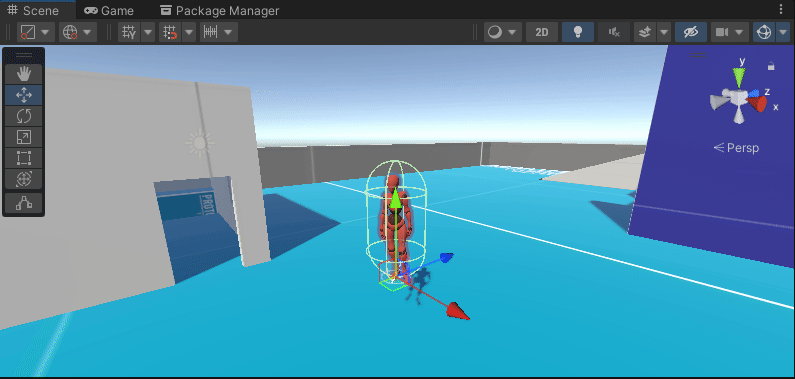
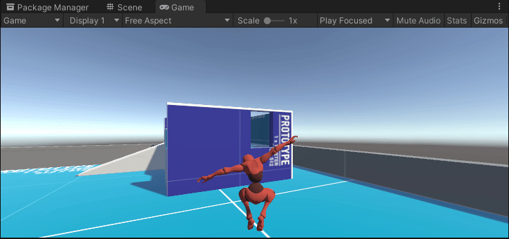

## Unity third person character controller tutorial
The character controller is the most interactive game play element in most of the games, so naturally so it should be the most smooth and bug-free.  
In this tutorial you will learn how to create a third person character controller in unity, as well as a third person camera with collision detection that properly handles indoor collisions as well.  

**Download the project files for this tutorial from [CodeCreatePlay360](https://www.patreon.com/CodeCreatePlay360 "CodeCreatePlay"), it has a starting scene and necessary assets set up for you.**  
**Visit [Link](https://discord.gg/EKmhB8xTq9 "DiscordChannel") channel for any discussion.**

   |  |
   | :--: |
   | Character movements |

### Part 1 Character movements

1. Open **SceneStart** from project files, create a new layer **Collision**, select **PrototypeScene** game-object from hierarchy and change its layer to **Collision**, ideally any scene geometry should have this layer, we will use this layer for collision detection. 
2. From project files drag the **Player** prefab in the scene, set its tag to **Player**, it has a **Capsule collider** and **Animator** components attached to it make sure of that, drag **PlayerCam.cs** from scripts folder onto the main camera, if it isn't already there, this is basic orbiting camera script, and finally set its tag to **MainCamera**, use a **game-object > capsule** as placeholder for player if you don't have project files, you will have to create a basic orbiting camera script though.  

_Create two new scripts **CharacterMotor.cs** and **PlayerAnim.cs** and attach them to player, copy paste this for both scripts respectively, this is necessary to make Animator work otherwise no animation will be played ( **only do this is you are using project files** )._

```
public class CharacterMotor : MonoBehaviour
{
    // public fields
    [HideInInspector] public Vector3 velocity = Vector3.zero;
    public bool grounded = false;
    public bool jumping = false;
}
```

```
public class PlayerAnim : MonoBehaviour
{
    public CharacterMotor character = null;
    public Animator animator;

    private void Start()
    {
        animator = GetComponent<Animator>();
        character = GetComponent<CharacterMotor>();
    }

    private void Update()
    {
        animator.SetBool("grounded", character.grounded);
        animator.SetBool("shouldMove", character.velocity.magnitude > 0.1f);
        animator.SetBool("shouldRun", character.velocity.magnitude > 0.1f && Input.GetKey(KeyCode.LeftShift));
        animator.SetBool("jumping", character.jumping);
    }
}
```

   |  |
   | :--: |
   | Default scene |

3. Roughly, this is how your setup should look like.

   |  |
   | :--: |
   |  |
   | Player prefab |

4. Open **CharacterMotor.cs** and add a class to group together movement settings.

```
namespace RPG_Character
{
    public class CharacterMotor : MonoBehaviour
    { 
        [System.Serializable]
        public class MovementSettings
        {
            public float walkSpeed = 1.7f;
            public float runSpeed = 3.527f;
            public float turnSpeed = 15f;
            public float jumpForce = 5f;
        }

        // initialize classes
        public MovementSettings movementSettings = new MovementSettings();


        void Start()
        {
        }

        void Update()
        {
        }
    }
}
```

5. Add a new variable velocity, this will be the speed with which character is moving, as **velocity = speed * rate of change of time**, for speed we can use **walk speed** or **run speed** and for time we can use unity's built in **Time.DeltaTime**, which is elapsed time since last frame, let's add this in code.

```
namespace RPGCharacter
{
    public class Character_Motor : MonoBehaviour
    {
        // private fields
        private Vector2 input;
        
        void Update()
        {
            input = new Vector2(Input.GetAxisRaw("Horizontal"), Input.GetAxisRaw("Vertical"));

            Move();
        }

        private void Move()
        {
            if (Mathf.Abs(input.x) > 0 || Mathf.Abs(input.y) > 0)
                velocity = new Vector3(0f, 0f, 1f);
            else
                velocity = Vector3.zero;

            if (Input.GetKey(KeyCode.LeftShift))
                velocity *= movementSettings.runSpeed;
            else
                velocity *= movementSettings.walkSpeed;

            // transform velocity vector from world space to local space
            velocity = transform.TransformDirection(velocity);

            if (velocity.magnitude > 0.1f)
                transform.position += velocity * Time.deltaTime;
        }
    }
}
```

6. The character can now walk and run in forward facing direction, to change the forward direction or rotation along y-axis of character we can use **Math.Atan2** function, and to keep direction relative to that of camera we have to add camera's y-rotation to it.

```
namespace RPGCharacter
{
    public class CharacterMotor : MonoBehaviour
    {
        // private fields
        private Camera cam;


        void Start()
        {
            cam = GameObject.FindGameObjectWithTag("MainCamera").GetComponent<Camera>();
        }

        void Update()
        {
            // ^^ previous code ^^
            Rotate();
        }
        
        private void Rotate()
        {
            if (velocity.magnitude == 0)
                return;

            float angle = Mathf.Atan2(InputManager.key.x, InputManager.key.y);
            angle = Mathf.Rad2Deg * angle;
            angle += cam.transform.localEulerAngles.y;
            Quaternion targetRotation = Quaternion.Euler(0, angle, 0);
            transform.rotation = Quaternion.Slerp(transform.rotation, targetRotation, movementSettings.turnSpeed * Time.deltaTime);
        }

    }
}
```

   |  |
   | :--: |
   | As an additional ( but not necessary ) step drag    **PlayerAnim.cs** from **ProjectFiles > Scripts** folder onto the **Player prefab**, this will properly handle animator parameters. |

7. Movement is done, now to make the character jump, to jump first we have to make sure if character is grounded, this can be best done using **Physics.SphereCast**, I also have created a new class to group together physics related settings and two new fields **jumping** and **grounded.**

```
namespace RPG_Character
{
    public class CharacterMotor : MonoBehaviour
    {
        [System.Serializable]
        public class PhysicsSettings
        {
            public LayerMask collisionLayer;
        }
        
        // initialize classes
        public PhysicsSettings phySettings = new PhysicsSettings();
        
        // public fields
        public bool grounded;
        public bool jumping;
        
        
        private void FixedUpdate()
        {
            // all physics related code should be called in FixedUpdate
            CheckGrounded();
        }
    
        private void CheckGrounded()
        {
            // since our character is pivot at its feet, I have added Vector3.up to bring raycast position to about center.
            Ray ray = new Ray(transform.position + Vector3.up, Vector3.down);

            if (Physics.SphereCast(ray, 0.15f, out RaycastHit hitInfo, 1, phySettings.collisionLayer))
            {
                grounded = true;
                jumping = false;
            }
            else
            {
                grounded = false;
            }
        }
    }
}
```

From **PhysicsSettings** set collision layer to **CollisionLayer**, move the character up and down the floor, notice **grounded** field updates accordingly.

8. Although now we can check if our character is grounded or not, to make sure the character doesn't sinks into the ground, create a new method **SnapToGround**, we will use **Phyics.OverlapSphereNonAlloc** to check for collider at feet of the player, and snap the character to it, also update the **PhysicsSettings** to make some settings editable from inspector.

```
        [System.Serializable]
        public class PhysicsSettings
        {
            public LayerMask collisionLayer;
            public Vector3 groundCheckPoint = new Vector3(0, -0.01f, 0);
            public float distanceToGround = 1f;
            public float snapSmoothSpeed = 50f;
        }

        private void SnapToGround(RaycastHit hitInfo)
        {
            Collider[] colliders = new Collider[3];

            int num = Physics.OverlapSphereNonAlloc(
                transform.TransformPoint(phySettings.groundCheckPoint),
                0.55f,
                colliders,
                phySettings.collisionLayer);

            for (int i = 0; i < num; i++)
            {
                if (colliders[i].transform == hitInfo.transform)
                {
                    transform.position = Vector3.Lerp(
                        transform.position,
                        new Vector3(transform.position.x,
                        (hitInfo.point.y + phySettings.groundCheckPoint.y),
                        transform.position.z),
                        phySettings.snapSmoothSpeed * Time.deltaTime);

                    break;
                }
            }
        }
```

9. The best place to call this method is obviously when the character is confirmed grounded, in **CheckGrounded**, so update it as well.

```
        private void CheckGrounded()
        {
            Ray ray = new Ray(transform.position, Vector3.down);

            if (Physics.SphereCast(ray, 0.15f, out RaycastHit hitInfo, 1, phySettings.collisionLayer))
            {
                grounded = true;
                SnapToGround(hitInfo);
            }
            else
            {
                grounded = false;
            }
        }
```

   |  |
   | :--: |
   | Manually move the character, it will always stick to the ground. |

10. One final thing before adding jump is gravity, otherwise character won't return to the ground if it jumps, to add gravity first update code in **Move** function to move **vertically** or **horizontally** if grounded and not jumping. 

```
        private void Move()
        {
            if(!jumping && grounded)
            {
                if (Mathf.Abs(input.x) > 0 || Mathf.Abs(input.y) > 0)
                    velocity = new Vector3(0f, 0f, 1f);
                else
                    velocity = Vector3.zero;

                if (Input.GetKey(KeyCode.LeftShift))
                    velocity *= movementSettings.runSpeed;
                else
                    velocity *= movementSettings.walkSpeed;

                // transform velocity vector from world space to local space
                velocity = transform.TransformDirection(velocity);
            }

            if (velocity.magnitude > 0.1f)
                transform.position += velocity * Time.deltaTime;
        }
```

Next add a new function **ApplyGravity** and apply gravity is downward direction if character is not grounded.

```
        private void ApplyGravity()
        {
            if (!grounded)
                velocity += Vector3.down * phySettings.gravity * Time.deltaTime;
        }
``` 

   |  |
   | :--: |
   |  |
   | Move the character 2 to 3 meter above the ground and release it will fall under force of gravity, it also works it character falls from some height... also if you notice the gravity and ground snapping system works hand in hand to keep the character on the ground when walking up or down the slopes.  |

11. Add a new function **Jump**, give the character an upward velocity and an initial upward push.

```
        public void Jump()
        {
            if (!jumping)
            {
                velocity = new Vector3(velocity.x, movementSettings.jumpForce, velocity.z);
                transform.position += Vector3.up * 0.35f;  // give it an initial push otherwise it will consider it grounded for more than one frame
                jumping = true;
            }
        }
``` 

update the code in **Update** function to include jump and gravity.
 
```
        void Update()
        {
            input = new Vector2(Input.GetAxisRaw("Horizontal"), Input.GetAxisRaw("Vertical"));

            Move();
            Rotate();
            ApplyGravity();

            if (Input.GetKeyDown(KeyCode.Space))
                Jump();
        }
```

   |  |
   | :--: |
   | Now we can jump ! |

12. By now if you haven't noticed, instead of bumping into walls or obstacles our character goes straight through them, this is because there is no collision detection, adding it is easy, we will use unity's **OverlapCapsuleNonAlloc** to detect obstacles and use vector projection to slide against the collider, add a new function **CollisionDetection** and call it from **FixedUpdate**. 

```
        private void FixedUpdate()
        {
            CheckGrounded();
            CollisionDetection();
        }

        private void CollisionDetection()
        {
            Collider[] overlaps = new Collider[4];
            CapsuleCollider capsuleCollider = GetComponent<CapsuleCollider>();
            Collider myCollider = capsuleCollider;

            int num = Physics.OverlapCapsuleNonAlloc(
                capsuleCollider.transform.position + Vector3.up * capsuleCollider.height / 2,
                capsuleCollider.transform.position + Vector3.down * capsuleCollider.height / 2,
                capsuleCollider.radius,
                overlaps,
                phySettings.collisionLayer);

            for (int i = 0; i < num; i++)
            {
                Transform t = overlaps[i].transform;

                if (Physics.ComputePenetration(myCollider,
                    transform.position,
                    transform.rotation,
                    overlaps[i], t.position,
                    t.rotation,
                    out Vector3 dir,
                    out float dist))
                {
                    Vector3 penetrationVector = dir * dist;
                    // Vector3 velocityProjected = Vector3.Project(velocity.normalized, -dir);
                    // vel -= velocityProjected;
                    transform.position = transform.position + penetrationVector;
                }
            }
        }
```

   |  |
   | :--: |
   | Collision detection ! |

____
#### That's it for this part, in next part we will go about creating the third person camera system, visit CodeCeatePlay for latest updates. Email CodeCreatePlay360@gmail.com for any feedback suggestions etc.
