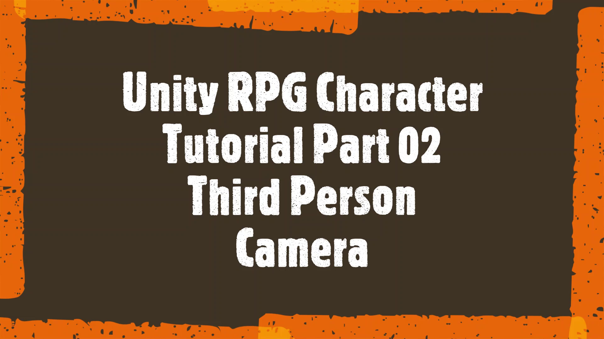
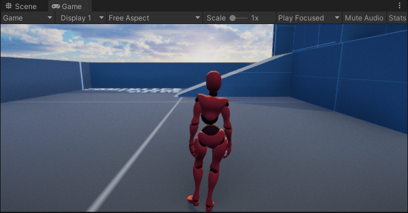

## Unity third person character controller tutorial
In this second part of RPG character controller tutorial series, we will begin programming a third person camera with features such as orbit and zoom in and out on target. 

**Visit all parts of this tutorial series and download project files for this tutorial from [CodeCreatePlay360](https://www.patreon.com/CodeCreatePlay360 "CodeCreatePlay"), it has a starting scene and necessary assets set up for you.**  
**Visit [Discord](https://discord.gg/EKmhB8xTq9 "DiscordChannel") channel for any discussion.**

   |  |
   | :--: |
   | --- |

### Part 2 Third Person Camera
1. From project files, open the start scene, this scene has the character controller we created in previous tutorial, however you can have any character controller and the camera system will still work, just make sure your player / character controller has the **Player** tag set to it.

   |  |
   | :--: |
   | Default scene |

2. In scripts folder create new script **CameraController.cs** and attach it to **MainCamera**, also make sure it has the **MainCamera** tag.
3. There are 4 main features to implement for a typical third person camera you see in most games.
      * Camera should always follow the player
      * Camera should have always look at player
      * Camera should be able to rotate around player along x and y axis.
      * Camera should be able to zoom in and out on player.
4. Lets begin by implementing the first feature I.E **making camera follow the player**, open **CameraController.cs**, add a reference to player game object and add a new function **FollowTarget**, call it from **LateUpdate**.

```
    public class CameraController : MonoBehaviour
    {
        [Header("References")]
        public Transform target = null;


        private void Start()
        {
            // find the character controller component if not set from inspector
            if (target == null)
                target = GameObject.FindGameObjectWithTag("Player").transform;
        }

        private void LateUpdate()
        {
            // since player will be updating movements from Update method and camera movements are relative to player movements
            // so to avoid jerkiness camera movements should be in LateUpdate.
            FollowTarget();
        }

        void FollowTarget()
        {

        }
    }
```

5. To make an object follow some target set object ( in our case the camera ) position to target position along with some position offset.

```
    public class CameraController : MonoBehaviour
    {
        [System.Serializable]
        public class MovementSettings
        {
            public Vector3 targetPosOffset = new Vector3(0f, 1.8f, -2.5f);
        }

        [Header("Settings")]
        public MovementSettings movementSettings = new MovementSettings();
        
        // private
        private Vector3 targetPos;
        
        
        void FollowTarget()
        {
            transform.position = target.position + movementSettings.targetPosOffset;
        }
    }
``` 

   |  |
   | :--: |
   | Camera follow |

6. To create a rotation along any axis x, y or z, we can use unity's builtin **Quaternion.Euler**.

```
    public class CameraController : MonoBehaviour
    {
        private void LateUpdate()
        {
            FollowTarget();
            Orbit();
        }
        
        float y_Orbit;
        void Orbit()
        {
            y_Orbit += 30f * Time.deltaTime;
            Quaternion targetRot = Quaternion.Euler(0f, y_angle, 0f);
            transform.rotation = targetRot;
        }
    }
```

   |  |
   | :--: |
   | Top down view of rotation along y axis |

However this only returns a rotation, what we need is camera to orbit around the player, for that we need to convert this rotation into a position or **Vector3**... rotations represented using **Quaternions** can be converted to positions by multiplying them with a vector, in our case **-Vector.forward** and to offset it behind the player at some fixed distance we can multiply it by some **distanceToTarget** variable.

```
    public class CameraController : MonoBehaviour
    {
        float y_Orbit;
        float distanceToTarget = 3;
        void Orbit()
        {
            y_Orbit += 45f * Time.deltaTime;
            Vector3 orbitPos = Quaternion.Euler(0f, y_Orbit, 0f) * (-Vector3.forward * distanceToTarget);
            orbitPos += targetPosOffset;
            transform.position = orbitPos;
        }
    }
```

now that the camera z offset depends on  **distanceToTarget** variable remove z-offset from **targetPosOffset** we created earlier, otherwise this offset will be added to orbiting position.

```
    public Vector3 targetPosOffset = new Vector3(0f, 1.8f, 0f);
```

   |  |
   | :--: |
   | Camera now orbits around the player. |

The camera orbit is now controlled by a fixed value lets change this to use mouse input and create a new variable to control orbit speed.

```
    public class CameraController : MonoBehaviour
    {
        float y_Orbit;
        float orbitSpeed = 60f;
        float distanceToTarget = 3;
        void Orbit()
        {
            y_Orbit += Input.GetAxis("Horizontal") * orbitSpeed * Time.deltaTime;
            Vector3 orbitPos = Quaternion.Euler(0f, y_Orbit, 0f) * (-Vector3.forward * distanceToTarget);
            orbitPos += targetPosOffset;
            transform.position = orbitPos;
        }
    }
```

7. The camera now orbits around the player but does not looks at it, so lets do this first before we add the zoom function...unity's builtin **Quaternion.LookRotation** creates a rotation with forward vector always pointing towards the argument direction, in our case to get a direction towards the player we subtract target position along with position offset from camera position.

```
    public class CameraController : MonoBehaviour
    {
        private void LateUpdate()
        { 
            FollowTarget();
            Orbit();
            LookAtTarget();
        }
    
    
        float lookSmooth = 100f;
        void LookAtTarget()
        {
            Vector3 lookDirection = (target.position + movementSettings.targetPosOffset) - transform.position;
            Quaternion lookRotation = Quaternion.LookRotation(lookDirection);
            transform.rotation = Quaternion.Lerp(transform.rotation, lookRotation, lookSmooth * Time.deltaTime);
        }
    }
```

   |  |
   | :--: |
   | Camera always rotates to face the player |

8. Before proceeding any further first lets organize the code into classes to make our code easier to read and extend later on and to make settings configurable from inspector, so here is how our code looks now.

```
        [System.Serializable]
        public class PositionSettings
        {
            public Vector3 targetPosOffset = new Vector3(0f, 1.8f, 0f);
            public float distanceToTarget = 3f;
        }

        [System.Serializable]
        public class OrbitSettings
        {
            public float y_Orbit;
            public float orbitSpeed = 60f;
            public float lookSmooth = 200f;
        }


        [Header("Settings")]
        public PositionSettings positionSettings = new PositionSettings();
        public OrbitSettings orbitSettings = new OrbitSettings();

        [Header("References")]
        public Transform target = null;  // player

        // private
        private Vector3 targetPosOffset;
        private Vector3 orbitPos;


        private void Start()
        {
            // find the character controller component if not set from inspector
            if (target == null)
                target = GameObject.FindGameObjectWithTag("Player").transform;
        }

        private void Update()
        {
        }

        private void LateUpdate()
        {
            FollowTarget();
            Orbit();
            LookAtTarget();
        }

        void FollowTarget()
        {
            targetPosOffset = target.position + positionSettings.targetPosOffset;
            transform.position = targetPosOffset;
        }

        void Orbit()
        {
            orbitSettings.y_Orbit += orbitSettings.orbitSpeed * Time.deltaTime;
            Vector3 orbitPos = Quaternion.Euler(0f, orbitSettings.y_Orbit, 0f) * (-Vector3.forward * positionSettings.distanceToTarget);
            orbitPos += targetPosOffset;
            transform.position = orbitPos;
        }

        void LookAtTarget()
        {
            Vector3 lookDirection = (target.position + positionSettings.targetPosOffset) - transform.position;
            Quaternion lookRotation = Quaternion.LookRotation(lookDirection);
            transform.rotation = Quaternion.Lerp(transform.rotation, lookRotation, orbitSettings.lookSmooth * Time.deltaTime);
        }
    }
```

   |  |
   | :--: |
   | Our camera controller up to this point |

9. Finally adding zoom is as simple as changing **PositionSettings.distanceToTarget** variable, with some limitations to apply min and max distance from player.  
To add zoom create a new function **Zoom**, call it from **LateUpdate** before **LookAtTarget**.

```
    public class CameraController : MonoBehaviour
    {
        [System.Serializable]
        public class PositionSettings
        {
            ^^ previous code ^^
            public float zoomSmooth = 120f;
            public float minZoom = 1.5f;
            public float maxZoom = 4f;
        }
        
        private void LateUpdate()
        {
            FollowTarget();
            Orbit();
            Zoom();
            LookAtTarget();
        }
        
        void Zoom()
        {
            positionSettings.distanceToTarget += Input.GetAxis("Mouse ScrollWheel") * positionSettings.zoomSmooth * Time.deltaTime;

            positionSettings.distanceToTarget = Mathf.Max(positionSettings.distanceToTarget, positionSettings.minZoom);
            positionSettings.distanceToTarget = Mathf.Min(positionSettings.distanceToTarget, positionSettings.maxZoom);
        }
    }
```

   |  |
   | :--: |
   | Camera zoom |

____
#### That's it for this part, in next part we will create the camera's collision detection system, visit CodeCeatePlay for latest updates. Email CodeCreatePlay360@gmail.com for any feedback suggestions etc.

