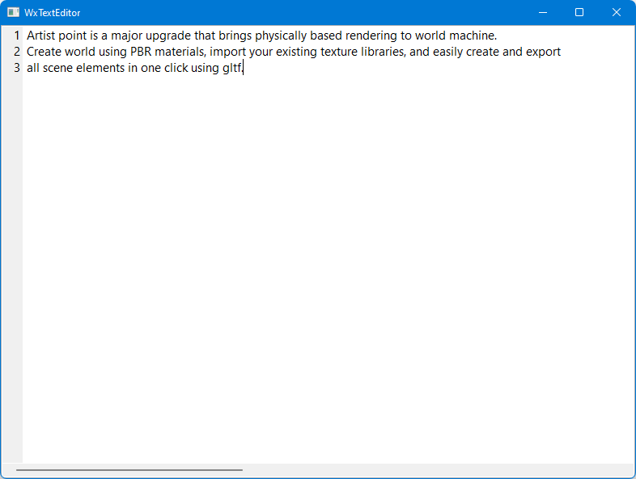

## Create an intermediate level text editor using wxPython

**In this tutorial we will create an slightly advanced notepad with file open, save, edit, copy, paste and a few more features.**  
**We will use wxPython to create the UI, you should have at least beginner level understanding of it, however I will still try to explain as best as I could as we go along.**

   * |  |
     | :--: |
     | TextEditor ! |

|  |
| :--: |
| If you haven't already installed **wxPython**, open command prompt and type the following command **pip install wxPython**, this will automatically install matching version of **wxPython** for your python installation and necessary dependencies. |

***
**Visit [CodeCreatePlay360](https://www.patreon.com/CodeCreatePlay360 "CodeCreatePlay") for more software engineering and video games development tutorials.**  
**Download project files from this [post](https://www.patreon.com/posts/project-files-68614656?utm_medium=clipboard_copy&utm_source=copyLink&utm_campaign=postshare_creator "ProjectFiles") on CodeCreatePlay.**  
**Also join the [discord](https://discord.gg/EKmhB8xTq9 "discord") channel.**
***

1. To start off this tutorial create a new python file and import the **wx** name-space...in any **wxPython** application the first two steps are always creating a **wxPython app object** and a **wxFrame**, all other windows are parented to **wxFrame**, see the comments for details.

```
import wx


class WxFrame(wx.Frame):
    def __init__(self, parent, title, min_size):
        wx.Frame.__init__(self, parent, title=title)
        self.min_size = min_size

        self.SetMinSize(self.min_size)
        self.SetSize(self.min_size)
        self.Center()
        self.Show()


def main():
   # create the wx app object
    wx_app = wx.App()
    
    # the input arguments to wxFrame are (parent, name and size)
    frame = WxFrame(None, "WxNotepad", wx.Size(800, 600))

    # start the application's main loop
    wx_app.MainLoop()


if __name__ == '__main__':
    main()
```

|  |
| :--: |
| wxFrame |

2. We will be keeping the UI separated from application logic and hook them both using events, so for UI create a new python file and create the base or parent panel for our notepad UI, in **wxPython** a panel is basically a container for widgets ( buttons, check-boxes, static texts etc.),

```
import wx


class TextEditorPanel(wx.Panel):
    def __init__(self, parent, *args, **kwargs):
        wx.Panel.__init__(self, parent)
```

initialize **TextEditorPanel** from frame class before the call to **SetMinSize**,

```
self.text_ed_panel = TextEditorPanel(self)
```

by default if there is only one panel and initialized from inside frame it covers the entire area of frame (you can verify this by setting a different color for panel in its **init** function), however for more than one panel or nested panel (panel inside another panel) you should use **sizers**,

```
# change color of an panel by this function call, this also works for other widgets too.
self.SetBackgroundColour(wx.YELLOW)
```

3. We will have 3 main parts in this applications
   * menu bar ( red )
   * text editor window ( green )
   * and at the very bottom, the status bar ( blue )

|  |
| :--: |
| wxFrame |

4. Lets begin by creating text editor panel, we will be using the **StyledTextEditor** implemented in the **wx.stc** name-space, **StyledTextEditor** itself is a one to one mapping of raw **scintilla** interface you can read more about it at [scintilla.org](http://scintilla.org "scintilla.org").  
Import the **StyledTextEditor** and initialize it in **TextEditorPanel**, the code itself is pretty self explanatory, we are creating an instance of **stc.StyledTextCtrl** and setting its various **settings** see comments along code for details.

```
    def __init__(self, parent, *args, **kwargs):
        wx.Panel.__init__(self, parent)
        self.frame = parent

        self.left_margin_width = 25

        self.text_editor = None
        self.create_text_editor()

    def create_text_editor(self):
        self.text_editor = stc.StyledTextCtrl(self, style=wx.TE_MULTILINE | wx.TE_WORDWRAP)
        
        # 
        # control + = to zoom in
        self.text_editor.CmdKeyAssign(ord('='), stc.STC_SCMOD_CTRL, stc.STC_CMD_ZOOMIN)

        # control - = to zoom out
        self.text_editor.CmdKeyAssign(ord('-'), stc.STC_SCMOD_CTRL, stc.STC_CMD_ZOOMOUT)

        # not show white space
        self.text_editor.SetViewWhiteSpace(False)

        # line numbers
        self.text_editor.SetMargins(5, 0)
        self.text_editor.SetMarginType(1, stc.STC_MARGIN_NUMBER)
        self.text_editor.SetMarginWidth(1, self.left_margin_width)
```

|  |
| :--: |
| -- |

5. Before implementing shortcuts or systems such as new file, save or load, we will be creating a menu bar.  
In **wxPython** a **menubar** can only be set to a frame, so create a new **menubar** object and set it to parent frame object.

```
    def create_menu_bar(self):
        self.menu_bar = wx.MenuBar()
        self.frame.SetMenuBar(self.menu_bar)
```

to create a menu for a **menubar**, use a **wx.Menu** object, **wx.Menu** takes a unique identifier as first argument and name of menu as the second argum,**wxPython** provides unique ids for common menu items such as **wx.ID_NEW**, **wx.ID_SAVE_AS** or you can generate a new ID using **wx.NewId()**.  
First generate a new id

```
    id_new = wx.NewId()
```

```
    def create_menu_bar(self):
        # the file_menu
        file_menu = wx.Menu()

        # bind frame to respond to menu event
        # the first argument to Bind is the event_type
        and second is the function to invoke when a
        menu is clicked
        self.frame.Bind(wx.EVT_MENU, self.on_event)
        
        # ----------------------
        # sub-menus of file menu  
        file_menu.Append(self.id_new, "&New")
        file_menu.Append(self.id_open, "&Open")
        file_menu.Append(self.id_save, "&Save")
        file_menu.Append(self.id_save_as, "Save &As")
        
        # AppendSeparator add a line between two menus
        file_menu.AppendSeparator()
        
        file_menu.Append(self.id_close, "&Close")
        # -------------------------------------------------
        
        # finally add file menu to menu_bar
        self.menu_bar.Append(file_menu, "&File")

    def on_event(self, event):
        event.Skip()
```

call **create_menu_bar** function just before call to **create_text_editor**, run the code you should see the file menu.  
Now in **on_event function** you can check for id's type like this

```
    def on_file_new(self):
        print("create new file")

    def on_event(self, event):
        evt_id = event.GetId()

        if evt_id == self.id_new:
            self.on_file_new()

        event.Skip()
``` 

however as number of menus increase, the number of if statements increases proportionally, so as an alternative we will map event ids to functions using a dictionary, it will make the code more cleaner and easy to read.  
Create event map just before call to **create_text_editor** function.

```
# map events to their respective function calls
self.event_map = {
    self.id_new: self.on_file_new,
    self.id_open: self.on_file_open,
    self.id_save: self.on_file_save,
    self.id_save_as: self.on_file_save_as,
    self.id_close: self.on_close
}
```

Now in **on_event** you can invoke a function like this

```
    def on_event(self, event):
        evt_id = event.GetId()

        if evt_id in self.event_map.keys():
            function = self.event_map[evt_id]
            function()

        event.Skip()
```

Now you know how to create and bind menu items to their events, create the remaining menus as well.


|  |
| :--: |
| -- |

For **Edit** menus, we can use lambda function in event_map to invoke a corresponding function call,

```
        self.event_map = {
            # ^^ previous event maps ^^
            self.id_undo: lambda: self.text_editor_ctrl.Undo(),
            self.id_redo: lambda: self.text_editor_ctrl.Redo(),
            self.id_select_all: lambda: self.text_editor_ctrl.SelectAll(),
            self.id_copy: lambda: self.text_editor_ctrl.Copy(),
            self.id_cut: lambda: self.text_editor_ctrl.Cut(),
            self.id_paste: lambda: self.text_editor_ctrl.Paste(),
        }
```

For operations of menus in **File** menu we first have to import the **os** module 

```
import os
```

we also need to keep a record of current saved file and current directory, for that create two new variables as well

```
self.save_file_dir = ""
self.save_file_name = ""
```
 
the **create new file** and **close** are pretty straight forward

```
def on_file_new(self):
    self.save_file_dir = ""
    self.save_file_name = ""
    self.text_editor_ctrl.SetValue("")

def on_close(self):
    self.frame.Close()
```
 
implementing save system is not that hard as well, since most heavy lifting is done behind the scene by **StyledTextCtrl**, see comments along the code for details.

```
    def on_file_save(self):
        if os.path.isdir(self.save_file_dir) and os.path.isfile(self.save_file_name):
            with open(os.path.join(self.save_file_dir, self.save_file_name), 'w') as f:
                f.write(self.text_editor_ctrl.GetValue())
                f.close()
        else:
            self.on_file_save_as()

    def on_file_save_as(self):
        # first check if the directory of last save already exists,
        # if yes than set browse directory to that
        if os.path.isdir(self.save_file_dir):
            browse_dir = self.save_file_dir
        # else set browse directory to current working directory
        else:
            browse_dir = os.getcwd()
         
        # wx.FileDialog is a standard file browser
        flags = wx.FD_SAVE | wx.FD_OVERWRITE_PROMPT
        dlg = wx.FileDialog(self, "Save file as", browse_dir, "Untitled", "*.txt*", flags)
        if dlg.ShowModal() == wx.ID_OK:
            self.save_file_name = dlg.GetFilename()
            self.save_file_dir = dlg.GetDirectory()
            f = open(os.path.join(self.save_file_dir, self.save_file_name), 'w')
            f.write(self.text_editor_ctrl.GetValue())
            f.close()

        dlg.Destroy()
```

open file operation is similar to save system, see comments along code for details

```
    def on_file_open(self):
        # first check if the directory of last save already exists,
        # if yes than set browse directory to that
        if os.path.isdir(self.save_file_dir):
            browse_dir = self.save_file_dir
        # else set browse directory to current working directory
        else:
            browse_dir = os.getcwd()

        try:
            dlg = wx.FileDialog(self, "Choose a file", browse_dir, "", "*.txt*", wx.FD_OPEN)
            if dlg.ShowModal() == wx.ID_OK:
                self.save_file_name = dlg.GetFilename()
                self.save_file_dir = dlg.GetDirectory()
                f = open(os.path.join(self.save_file_dir, self.save_file_name), 'r')
                self.text_editor_ctrl.SetValue(f.read())
                f.close()
            dlg.Destroy()

        except:
            dlg = wx.MessageDialog(self, "Couldn't open the file", "Error", wx.ICON_ERROR)
            dlg.ShowModal()
            dlg.Destroy()
```

6. Besides these basic file operations there are there settings that you can set for **StyledTextControl** for example toggling line numbers display on and off, here I will show an example, for a complete list of these settings visit **wx.stc.StyledTextControl** documentation.  
First we need a **bool** to check if line numbers are toggled or not.

```
self.line_numbers_enabled = False
```

then in **on_toggle_line_number_display**

```
    def on_toggle_line_numbers_display(self):
        if self.line_numbers_enabled:
            self.text_editor_ctrl.SetMarginWidth(1, 0)
            self.line_numbers_enabled = False
        else:
            self.text_editor_ctrl.SetMarginWidth(1, self.left_margin_width)
            self.line_numbers_enabled = True
```

|  |
| :--: |
| -- |

7. In most applications there is a help or about dialog, in **WxPython** you can do this using **wx.MessageDialog**.

```
    def show_about_dialog(self):
        dlg = wx.MessageDialog(None, "WxPython Text Editor Tutorial...!", "About", wx.OK | wx.ICON_INFORMATION)
        dlg.ShowModal()
        dlg.Destroy()
``` 

|  |
| :--: |
| -- |

8. To display messages such as info, errors or warnings messages when prompting the user with a separate dialog is not desirable it is best to use status bar.  
In **wxPython** a status bar can only be set to a frame,  

```
        # create status bar
        self.frame.CreateStatusBar()
        self.frame.StatusBar.SetBackgroundColour((220, 220, 220))
```

and to update status bar text

```
        msg_str = "Status bar text"
        self.frame.StatusBar.SetStatusText(msg_str, 0)
```

as an example I am updating status bar text after in **on_toggle_line_numbers_display** function.

```
    def update_status_bar_text(self):
        line = self.text_editor_ctrl.GetCurrentLine() + 1
        col = self.text_editor_ctrl.GetColumn(self.text_editor_ctrl.GetCurrentPos())
        stat = "[Info] Line %s, Column %s" % (line, col)
        self.frame.StatusBar.SetStatusText(stat, 0)
```

|  |
| :--: |
| -- |

however you can update status bar after any event as you like.

9. Overall your professional application is ready, as final finish you want to set a logo or icon for your app, this is completed in three simple steps, 
   * you first need a icon in **.ico** format and a reference to its path,
   * load the icon using **wx.Icon**
   * finally icon to your frame

```
    # load and set the icon
    icon_file = "Resources/notepad.ico"
    icon = wx.Icon(icon_file, wx.BITMAP_TYPE_ICO)
    frame.SetIcon(icon)
```

|  |
| :--: |
| -- |

**_its all done now, you can now publish this application, if you have any questions join to CodeCreatePlay discord server, I'll be glad to help._** 
